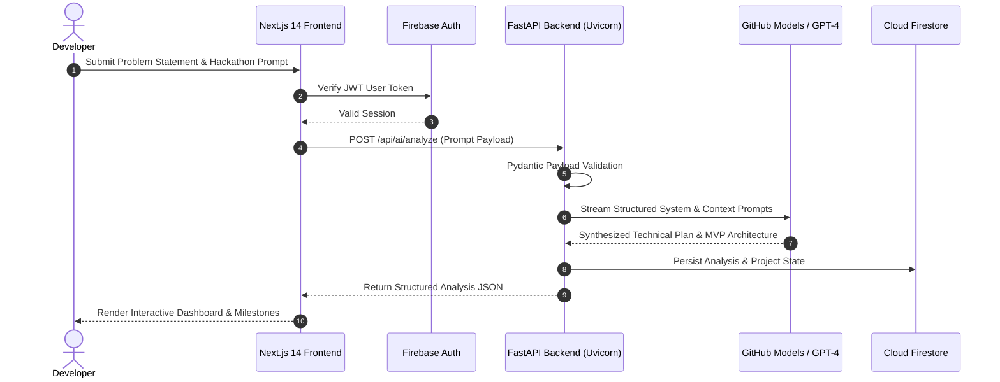

# 🚀 CodePilot AI — Full-Stack Autonomous Hackathon Co-Pilot & Engineering Intelligence SaaS

[](https://github.com/DivyeBhatnagar/-CodePilot-AI---Your-AI-Hackathon-Companion)
[](https://nextjs.org/)
[](https://react.dev/)
[](https://fastapi.tiangolo.com/)
[](https://python.org/)
[](https://www.typescriptlang.org/)
[](https://platform.openai.com/)
[](https://firebase.google.com/)
[](https://opensource.org/licenses/MIT)

> **Enterprise-Grade AI SaaS for Accelerated Hackathon Prototyping, Automated MVP Scaffolding, Live Code Refactoring, and Pitch Intelligence.**  
> Engineered with an asynchronous **FastAPI** backend, **Next.js 14 App Router** frontend, **GPT-4 / GitHub Models API**, and **Firebase Authentication & Cloud Firestore**.

---

## 📌 Architecture & System Overview

**CodePilot AI** transforms unstructured hackathon problem statements into validated technical architectures, sprint breakdowns, production code implementations, and investor-grade pitches in seconds.

```
                   ┌──────────────────────────────────────────────────────────┐
                   │                 NEXT.JS 14 FRONTEND                      │
                   │    (React 18 • TypeScript • Tailwind CSS • Monaco Editor) │
                   └───────────────┬──────────────────────────┬───────────────┘
                                   │                          │
                    Firebase Auth  │                          │  Async REST APIs
                    (OAuth / JWT)  │                          │  (CORS + Pydantic)
                                   ▼                          ▼
       ┌─────────────────────────────────────┐      ┌─────────────────────────────────────┐
       │     GOOGLE FIREBASE INFRASTRUCTURE  │      │       FASTAPI ASYNC BACKEND         │
       ├─────────────────────────────────────┤      ├─────────────────────────────────────┤
       │ • Firebase Authentication (Tokens)  │      │ • Modular API Routers (/ai, /auth)  │
       │ • Cloud Firestore NoSQL Database    │      │ • GitHub Models & OpenAI GPT-4 SDK  │
       │ • Security Rules & Audit Tracing    │      │ • Execution Timing & Error Handlers │
       └─────────────────────────────────────┘      └─────────────────────────────────────┘
```

---

## 🚀 Core Technical Competencies & Skills Matrix

| Domain | Core Skills & Technology Keywords |
| :--- | :--- |
| **Frontend Architecture** | `Next.js 14 (App Router)`, `React 18`, `TypeScript`, `Monaco Code Editor`, `Tailwind CSS`, `Framer Motion`, `Client/Server Components`, `Responsive UI/UX`, `State Management` |
| **Backend & Microservices** | `FastAPI (Python 3.11)`, `Uvicorn ASGI`, `Pydantic v2 Models & Settings`, `Async / Await I/O`, `HTTPX Async Client`, `CORS Middleware`, `Custom Exception Handling` |
| **Generative AI & LLMs** | `OpenAI GPT-4`, `GitHub Models API`, `Context-Aware Prompt Engineering`, `Automated Code Parsing`, `Code Refactoring`, `Natural Language Understanding (NLU)` |
| **Cloud & Database** | `Google Cloud Firestore NoSQL`, `Firebase Admin SDK`, `Firebase Authentication`, `Firestore Security Rules`, `JSON Web Tokens (JWT)` |
| **DevOps & Production** | `Vercel Deployment`, `Railway Hosting`, `Environment Isolation`, `RESTful API Design`, `Swagger / OpenAPI Specs`, `Git Workflow` |

---

## ⚡ Core Intelligent Modules

### 1. 🎤 Pitch Generator & Value Proposition Synthesizer
- Generates structured, persuasive pitch decks and elevator speeches from technical specifications.
- Tailors narrative voice for investor juries, technical judges, and non-technical stakeholders.

### 2. 📊 Problem Statement & Challenge Analyzer
- Deconstructs ambiguous prompt requirements into measurable deliverables, risks, and winning constraints.
- Identifies unaddressed target user pain points to boost originality and market relevance scores.

### 3. 🛠️ MVP Planner & Rapid Roadmap Scaffolder
- Generates 24-hour and 48-hour phased sprint schedules with prioritized must-have vs nice-to-have features.
- Recommends optimal architecture and modular component boundaries.

### 4. 🤖 AI Judge Intelligence & Multi-Dimensional Scoring
- Pre-evaluates submissions against standard hackathon judging criteria: *Innovation, Technical Complexity, Execution, UI/UX, and Pitch Delivery*.
- Delivers actionable gap analysis before final submissions.

### 5. 💻 Interactive Monaco Code Editor with Live Refactor & Explainer
- In-browser IDE powered by **Monaco Editor** with syntax highlighting and live execution review.
- Explains complex code snippets and provides instant refactoring suggestions for runtime efficiency and readability.

---

## 🏛️ System Workflows & Sequence Diagrams

### AI Hackathon Scaffolding Pipeline



---

## 📂 Repository Architecture

```
├── Backend/                          # Production FastAPI Application (Python 3.11)
│   ├── app/
│   │   ├── routers/                 # Modular Endpoint Controllers
│   │   │   ├── ai_router.py         # Primary AI Aggregator
│   │   │   ├── ai_pitch.py          # Pitch & Narrative Generation
│   │   │   ├── ai_explain.py        # Codebase Analysis & In-Depth Walkthroughs
│   │   │   ├── ai_refactor.py       # Automated Code Quality & Refactoring
│   │   │   ├── ai_score.py          # Hackathon Evaluation Engine
│   │   │   ├── ai_chat.py           # Real-Time Assistant WebSocket / REST
│   │   │   ├── auth_router.py       # Authentication Controller
│   │   │   └── hackathon_router.py  # Challenge Management & Project Tracking
│   │   ├── services/                # Business Logic & LLM Integrations
│   │   ├── schemas/                 # Pydantic v2 Data Validation Schemas
│   │   ├── middleware/              # Error Handlers, Timing & Security Filters
│   │   ├── config.py                # Environment Configuration
│   │   └── main.py                  # ASGI Server Entrypoint
│   ├── requirements.txt             # Python Dependencies
│   └── README.md
├── Frontend/                         # Next.js 14 App Router (React 18 + TS)
│   ├── app/                         # App Routes (dashboard, login, register)
│   ├── components/                  # UI Components (ProjectBuilder, CodeViewer)
│   ├── lib/                         # API Client & Firebase SDK Config
│   ├── public/                      # Static Assets & Icons
│   └── package.json                 # Frontend Dependencies & Scripts
├── firestore.rules                   # Database Security Policies
├── vercel.json                       # Vercel Deployment Settings
├── DEPLOYMENT_GUIDE.md               # Production Hosting Runbook
└── README.md                         # Project Master Documentation
```

---

## 🛠️ Technology Stack Breakdown

```
Frontend:           Next.js 14.2.5 • React 18 • TypeScript 5.0 • Tailwind CSS • Monaco Editor • Framer Motion
Backend:            FastAPI 0.109 • Uvicorn • Pydantic v2 • HTTPX • Python-dotenv
AI & Inference:     GitHub Models API • OpenAI GPT-4 Engine • Context-Aware Prompting
Cloud & DB:         Firebase Authentication • Google Cloud Firestore • Firebase Admin SDK
Hosting & DevOps:   Vercel (Edge Web App) • Railway / Render (FastAPI ASGI) • Swagger UI
```

---

## ⚙️ Quick Start & Installation

### 1. Prerequisites
- **Node.js**: `18.x+`
- **Python**: `3.11+`
- **Git**
- **GitHub Personal Access Token** (for GitHub Models / GPT-4)

### 2. Backend Setup
```bash
cd Backend

# Create virtual environment
python3 -m venv venv
source venv/bin/activate  # Windows: venv\Scripts\activate

# Install dependencies
pip install -r requirements.txt

# Configure environment variables
cp .env.example .env
```

Configure `.env` in the `Backend` directory:
```env
GITHUB_TOKEN=your_github_token_here
FIREBASE_PROJECT_ID=codepilot-ai--divye
FIREBASE_CREDENTIALS_PATH=./firebase-credentials.json
ENVIRONMENT=development
FRONTEND_URL=http://localhost:3000
```

Start the FastAPI server:
```bash
uvicorn app.main:app --reload --port 8000
```
> API Docs available at **http://localhost:8000/docs**

### 3. Frontend Setup
```bash
cd ../Frontend

# Install client packages
npm install
```

Create `.env.local` in `Frontend`:
```env
NEXT_PUBLIC_API_URL=http://localhost:8000
NEXT_PUBLIC_FIREBASE_API_KEY=your_firebase_api_key
NEXT_PUBLIC_FIREBASE_PROJECT_ID=codepilot-ai--divye
```

Run the Next.js development server:
```bash
npm run dev
```
Open [http://localhost:3000](http://localhost:3000) in your browser.

---

## 🔒 Security Architecture

- **Token-Based Authentication**: Seamless user verification using Firebase Auth JWTs.
- **Strict CORS & Input Validation**: Pydantic v2 validates all incoming payloads, blocking injection attacks.
- **NoSQL Granular Access Control**: Cloud Firestore security rules ensure complete user data isolation.
- **Isolated Sandbox Execution**: Monaco editor integration with isolated frontend code parsing.

---

## 📈 Engineering Impact & Resume Highlights

- **Engineered an end-to-end full-stack AI platform** using **Next.js 14**, **FastAPI**, and **GPT-4**, serving automated project planning and code generation tools.
- **Architected asynchronous high-throughput backend services** with FastAPI, Pydantic v2, and HTTPX, reducing response latency for complex multi-step prompts.
- **Integrated in-browser Monaco Editor** with AI-assisted real-time code explanations and intelligent refactoring capabilities.
- **Designed secure multi-tenant data storage** utilizing Firebase Authentication and Cloud Firestore with granular security rules.

---

## 📜 License
This project is open-source under the **MIT License**.

---

<p align="center">
  <b>Built to empower developers and accelerate innovative software engineering.</b>
</p>
